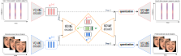

# A multimodal dynamical variational autoencoder for audiovisual speech representation learning
[]()
[](https://www.python.org/)
[](https://samsad35.github.io/site-mdvae/)

[comment]: <> ([![PyPI version fury.io]&#40;https://badge.fury.io/py/ansicolortags.svg&#41;]&#40;https://test.pypi.org/project/&#41;)

<video controls width="600"  loop autoplay muted>
  <source src="images/swap_w_visual_all.mp4" type="video/mp4">
</video>

This repository contains the code associated with the following publication:
> **A multimodal dynamical variational autoencoder for audiovisual speech representation learning**<br> Sadok, Samir and Leglaive, Simon and Girin, Laurent and Alameda-Pineda, Xavier and Séguier, Renaud<br>Neural Networks 2024.





Useful links:
- [Abstract](https://arxiv.org/abs/2305.03582)
- [Paper](https://www.sciencedirect.com/science/article/pii/S0893608024000340)
- [Demo website with qualitative results](https://samsad35.github.io/site-mdvae/)

## Setup 
- [ ] Pypi: (Soon) 

[comment]: <> (  - ``````)
- [ ] Install the package locally (for use on your system):  
  - In MDVAE directoy: ```pip install -e .```
- [x] Virtual Environment: 
  - ```conda create -n mdvae python=3.8```
  - ```conda activate mdvae```
  - In MDVAE directoy: ```pip install -r requirements.txt```

## Some functionalities 

### 1- Config
See the configuration of the model, the data, and the training in [config_mdvae](config_mdvae). Each time you run a training session, these configurations are automatically saved in the checkpoints.
```python
@hydra.main(config_path=f"config_mdvae", config_name="config")
```
### 2- VQ-VAE
You can download the pre-trained VQVAE models in [checkpoints/VQVAE](checkpoints/VQVAE).


```python
from mdvae import SpeechVQVAE, VisualVQVAE

speech_vqvae = SpeechVQVAE(**cfg.vqvae_1)
speech_vqvae.load(path_model=r"checkpoints/VQVAE/speech/model_checkpoint_Y2022M3D5")

visual_vqvae = VisualVQVAE(**cfg.vqvae_2)
visual_vqvae.load(path_model=r"checkpoints/VQVAE/visual/model_checkpoint_Y2022M2D13")
```
### 3- MDVAE model

```python
from mdvae import VQMDVAE
model = VQMDVAE(config_model=cfg.model, vqvae_speech=speech_vqvae, vqvae_visual=visual_vqvae)
```
You can load a pre-trained model in [checkpoints/MDVAE](checkpoints/MDVAE).
```python
model.load_model(path_model=f"{path}/mdvae_model_checkpoint")
model.to("cuda")
```
### 4- Training MDVAE
See the code [train_mdvae.py](train_mdvae.py).

```python
from mdvae import MdvaeTrainer
trainer = MdvaeTrainer(mdvae=model, vqvae_speech=speech_vqvae, vqvae_visual=visual_vqvae,
                           training_data=dataset_train, validation_data=dataset_validation,
                           config_training=cfg.training_config, audio_config=cfg.audio_config)
trainer.fit()
```

## Prepare data
### 1- H5 creation
In the code [h5_creation.py](test_h5_creation.py), a preprocessing step is executed for each modality to save the intermediate representations at the encoder output in an (.hdf5) file. This pre-processing step helps accelerate the training process.


### 2- Mead dataset 
In the *\__getitem\__()* of the MeadDateset dataset, we'll read the two H5s created previously for each modality and return both modalities with the same sequence length. 
```python
from mdvae import MeadDataset
dataset_train = MeadDataset(root_modality_1=Path(r"..."),
                                root_modality_2=Path(r"..."),
                                h5_speech_path=r"H5/speech_vq.hdf5",
                                h5_visual_path="H5/visual_vq.hdf5",
                                speaker_retain_test=["..."],
                                speaker_retain_validation=["..."],
                                train=True/False)
```
## Test
In the file [unit_test.py](unit_test.py), you'll find unit tests designed to evaluate the model, covering scenarios such as analysis-synthesis and analysis-transformation-synthesis...


## Citation
If you use this code for your research, please cite the above paper.
> @article{sadok2024multimodal, <br>
  title={A multimodal dynamical variational autoencoder for audiovisual speech representation learning},<br>
  author={Sadok, Samir and Leglaive, Simon and Girin, Laurent and Alameda-Pineda, Xavier and S{\'e}guier, Renaud},<br>
  journal={Neural Networks},<br>
  volume={172},<br>
  pages={106120},<br>
  year={2024},<br>
  publisher={Elsevier}<br>
}

```
## License
CC-BY-4.0, see LICENSE.txt.